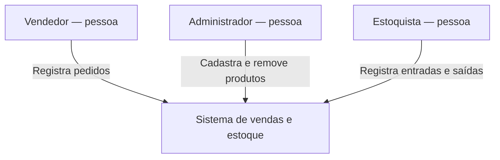
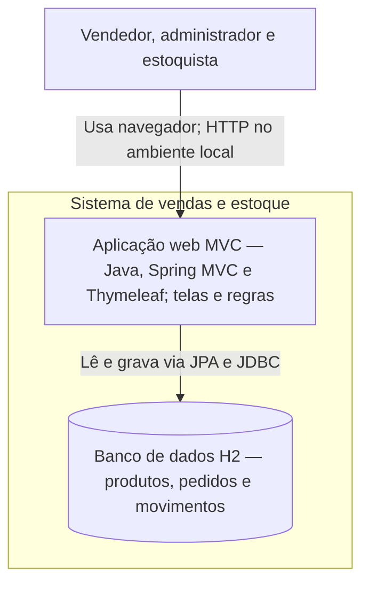
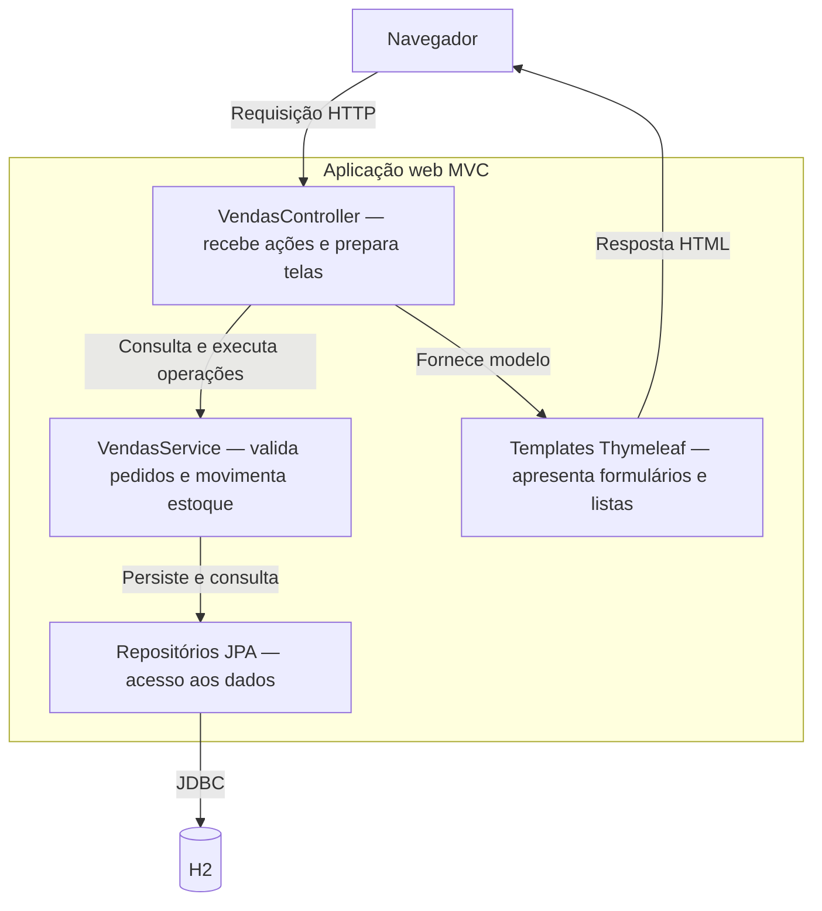
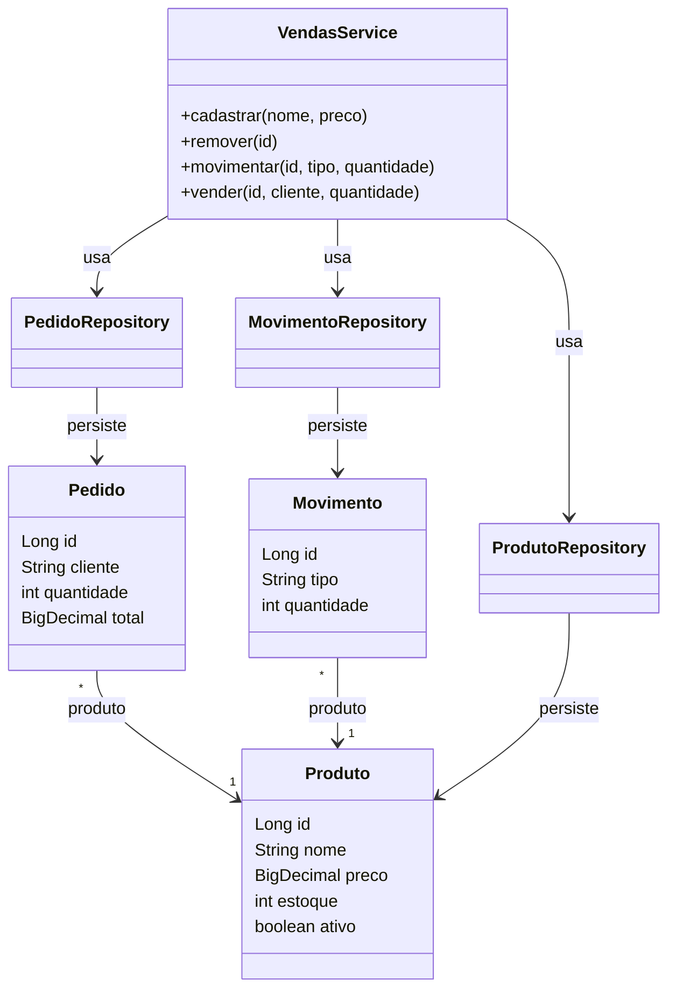

# Nosso primeiro C4

Sistema escolhido: vendas e estoque de uma empresa que recebe pedidos por telefone ou presencialmente. O vendedor digita o pedido; o cliente não acessa o sistema.

A aplicação é um monólito MVC com telas renderizadas no servidor. H2 é o armazenamento da versão didática, executado de forma embutida no mesmo processo; aparece separado como armazenamento no C4. Não há uma API ou aplicativo independente por perfil. Os diagramas usam Mermaid com os níveis do C4.

## c1-context.mmd

## c2-container.mmd

## c3-component.mmd

## c4-code.mmd

## Decisões e limites

- Um pedido contém um produto e uma quantidade nesta versão inicial.
- Confirmar pedido registra a saída automaticamente; não lançar outra saída manual para a mesma venda.
- Remover produto significa inativar, preservando o histórico. Produtos com saldo devem ter a saída registrada antes da remoção.
- Apresentação, domínio e dados são responsabilidades internas, não três servidores. No desenho anotado, os contêineres permanecem os mesmos.
- Perfis representam responsabilidades de negócio; a aplicação didática não implementa login ou autorização.
- Sem pagamentos, emissão fiscal, integração externa ou cancelamento de pedidos neste escopo.

Referência: [Modelo C4](https://c4model.com/diagrams).
